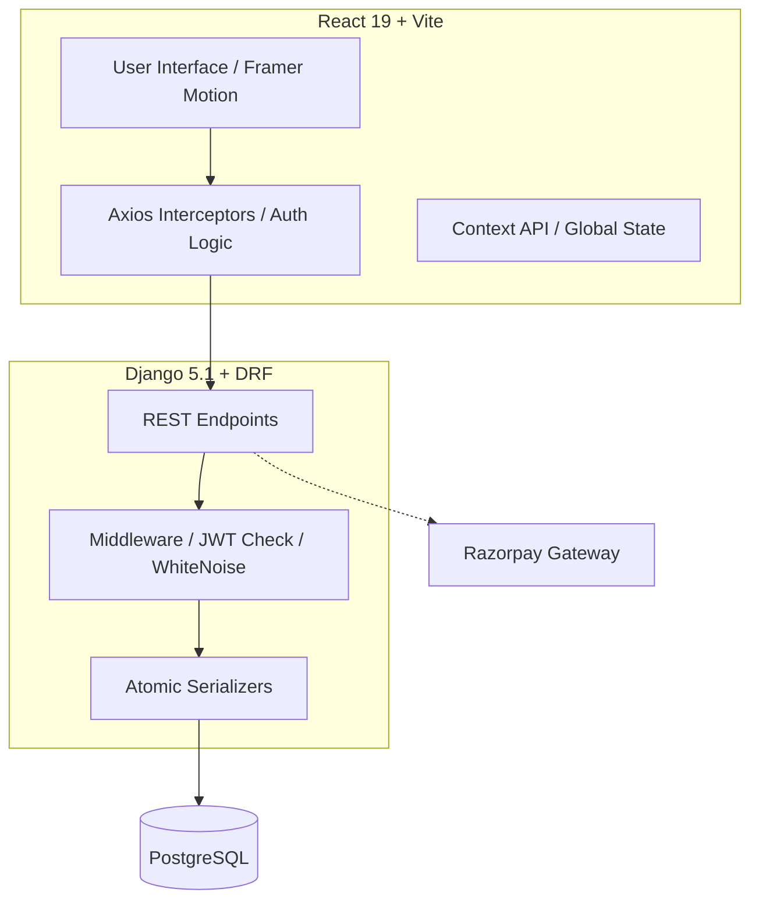

# 🍔 FoodDelivery | High-End Multi-Tenant Platform

[](https://food-delivery-seven-bice.vercel.app)
[](https://food-delivery-backend-c4pe.onrender.com/api)

A professional-grade, multi-role food delivery application built with **React (Vite)** and **Django REST Framework**. Designed for high-performance, security, and scalability with a modern, premium aesthetic.

---

## 🚀 Overview

This platform is a mission-critical food delivery system featuring three distinct access portals:
- **🛒 Customer App**: Discovery, Real-time Cart Management, and Secure Checkout.
- **🏬 Partner Portal**: For Restaurant Owners to manage menus, track orders, and update business profiles.
- **🛡️ Admin Console**: Oversight of the entire ecosystem, including users, payments, and system categories.

---

## 📺 Preview & Walkthrough

> [!TIP]
> **Video Demo**: [Drop your Loom or MP4 link here! GitHub allows you to drag/drop video files directly into the README editor.]
> <div style="position: relative; padding-bottom: 52.81250000000001%; height: 0;"><iframe src="https://www.loom.com/embed/dc254df85a25499d9ca6fb45293c8e41" frameborder="0" webkitallowfullscreen mozallowfullscreen allowfullscreen style="position: absolute; top: 0; left: 0; width: 100%; height: 100%;"></iframe></div>
> 
> *Recommended: Showcase the end-to-end flow from Customer order to Restaurant fulfillment.*

---

## 🏗️ System Architecture



### 💎 Technical Highlights

| Feature | Implementation | Engineering Benefit |
| :--- | :--- | :--- |
| **Auth** | JWT + Silent Rotation | Secure, session-persistent UX without re-logins. |
| **Data Integrity** | `@transaction.atomic` | Zero partial-data corruption on nested profile updates. |
| **Styling** | Tailwind CSS 4.0 | Zero-runtime CSS with modern container queries. |
| **State** | React Context API | Lean, performant global state without Redux boilerplate. |
| **Production** | WhiteNoise Storage | Manifest-locked caching for asset reliability. |

---

## 📂 Directory Structure

```text
food-delivery/
├── backend/            # Django Project
│   ├── core/           # Settings & Root URLs
│   ├── users/          # Custom Auth & JWT logic
│   ├── orders/         # Cart & Order processing
│   ├── restaurant/     # Multi-tenant business logic
│   └── postman.json    # API Collection
└── frontend/           # React App
    ├── src/
    │   ├── api/        # Unified Axios config
    │   ├── context/    # Global Auth state
    │   ├── layouts/    # Role-based UI shells
    │   └── pages/      # Feature-specific views
    └── .env.production # Environment config
```

---

## 🛠️ Industry-Standard Tech Stack

### Frontend (Modern React)
- **Framework**: `React 19` + `Vite` for ultra-fast HMR.
- **Styling**: `Tailwind CSS 4.0` (Native engine) for premium, design-system-first styling.
- **Animations**: `Framer Motion` for high-end micro-interactions and transitions.
- **Icons**: `Lucide React` for architectural consistency.
- **State & Auth**: `Context API` + `Axios Interceptors` for silent JWT token rotation.

### Backend (Robust Django)
- **Engine**: `Django 5.1` + `DRF (Django REST Framework)`.
- **Database**: `PostgreSQL` for reliable, transactional data persistence.
- **Security**: `SimpleJWT` with **Token Rotation** and **Blacklisting**.
- **Payments**: `Razorpay` integration for secure localized payment processing.
- **Production Storage**: `WhiteNoise` for manifest-locked compressed static files.

---

## ✨ Core Features

### 🤵 Customer Experience
- **Smart Discovery**: Browse active restaurants with dynamic categorized menus.
- **Real-time Cart**: Persistent cart logic with optimized item-level total calculations.
- **Secure Checkout**: Integrated Razorpay gateway with order verification hooks.
- **Order Tracking**: Detailed history with Fulfillment status updates.

### 🏢 Partner (Restaurant Owner) Portal
- **Dashboard**: Real-time analytics on store orders and performance.
- **Menu Management**: Full CRUD on store dishes with dynamic category grouping.
- **Order Fulfillment**: Expandable order details showing exact customer items and quantities.
- **Business Profile**: Atomic nested updates for store address, name, and contact info.

### 👑 System Administration
- **Global Overview**: Manage all registered restaurants and platform-wide categories.
- **Secure Operations**: Advanced order monitoring and manual fulfillment overrides.
- **Accounting**: Direct access to payment history and transactional logging.

---

## 🛠️ API Documentation (Postman)

To facilitate rapid testing and integration audits, a comprehensive **Postman Collection** is included in the repository.

- **Collection Path**: `backend/postman.json`
- **Setup**:
  1. Import the `postman.json` file into your Postman workspace.
  2. Configure an environment variable `base_url` pointing to your local or live backend.
  3. All endpoints for **Auth rotation**, **Order status management**, and **Multi-tenant profile updates** are pre-configured with example payloads.

---

## 🔒 Security & Performance Standards

This project implements professional-level security protocols required for modern web applications:
- **Silent JWT Rotation**: Access tokens expire every 60 minutes; refresh tokens (7 days) are rotated silently via axios interceptors.
- **Atomic Transactions**: Nested profile updates use `@transaction.atomic` to ensure data integrity.
- **Hardenened Settings**: Production flags enabled for `HSTS`, `SSL Redirect`, and `SECURE_COOKIES`.
- **Environment Aware**: No hardcoded API URLs. Uses `VITE_API_URL` consistently for seamless Dev/Prod transitions.

---

## 💻 Local Setup Guide

### 1. Backend Setup
```bash
cd backend
python -m venv venv
source venv/Scripts/activate  # Windows: venv\Scripts\activate
pip install -r requirements.txt
# Create a .env file based on .env.example
python manage.py migrate
python manage.py runserver
```

### 2. Frontend Setup
```bash
cd frontend
npm install
# Create .env.development with VITE_API_URL=http://localhost:8000/api
npm run dev
```

---

## 🌍 Deployment

- **Frontend**: Fully optimized for **Vercel** with manifest-static bundling.
- **Backend**: Deployed on **Render** using **Gunicorn** & **PostgreSQL**.

### Industry Pro-Tip:
*This project uses WhiteNoise for static asset compression and manifest versioning to maximize PageSpeed scores in a production environment.*

---

## 📄 License
This project is for educational/internship purposes. Developed for **FoodDelivery High-End Implementation**.
