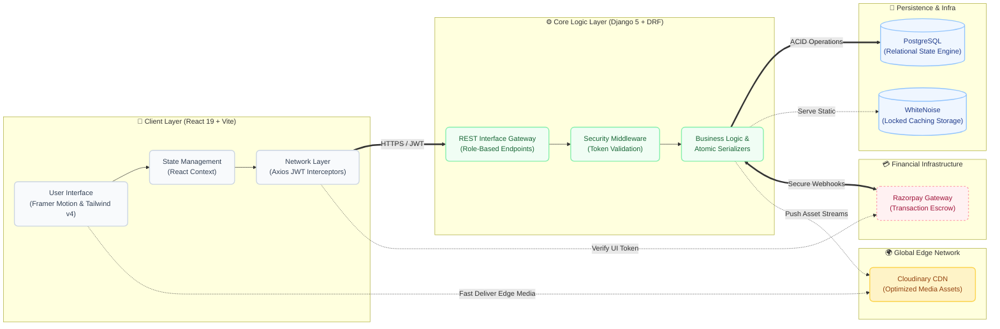

# Savor | Premium High-End Multi-Tenant Platform

[](https://food-delivery-seven-bice.vercel.app)
[](https://food-delivery-backend-c4pe.onrender.com/api)

A professional-grade, multi-role food delivery application built with **React (Vite)** and **Django REST Framework**. Designed for high-performance, security, and scalability with a modern, premium aesthetic.

---

## 🚀 Overview

This platform is a mission-critical, enterprise-grade food delivery system featuring four fully integrated, role-based access portals:
- **🛒 Customer App**: Discovery engine mapping out thousands of localized menu items, featuring real-time cart constraints, category exploration, and secure Razorpay checkout.
- **🏬 Partner Portal**: Isolated dashboards for Restaurant Owners to execute fast CRUD on daily menus, handle incoming operational tickets, and control storefront configurations.
- **🛵 Delivery Interface**: A dedicated mobile-responsive logistics layer allowing agents to claim geo-fenced dispatches, track fulfillment payouts, and flag live milestone updates.
- **🛡️ Admin Console**: Oversight of the entire ecosystem, including user governance, financial auditing, system diagnostics, and master platform categories.
---

## 📺 Preview & Walkthrough

> [!TIP]
> **Video Demo**: 
> 
> [**👉 CLICK HERE TO WATCH THE FULL PROJECT WALKTHROUGH VIDEO 👈**](#YOUR_VIDEO_LINK_HERE)
> 
> *(Add your video link above. The video demonstrates the end-to-end flow: Customer Order → Restaurant Fulfillment → Delivery Agent Completion)*

---

## 🏗️ System Architecture



### 💎 Technical Highlights

| Feature | Implementation | Engineering Benefit |
| :--- | :--- | :--- |
| **Auth** | JWT + Silent Rotation | Secure, session-persistent UX without re-logins. |
| **Data Integrity** | `@transaction.atomic` | Zero partial-data corruption on nested profile updates. |
| **Styling** | Tailwind CSS 4.0 | Zero-runtime CSS with modern container queries. |
| **State** | React Context API | Lean, performant global state without Redux boilerplate. |
| **Media Assets** | Cloudinary CDN | High-speed, edge-network delivery of optimized restaurant imagery. |
| **Production** | WhiteNoise Storage | Manifest-locked caching for static asset reliability. |

---

## 📂 Directory Structure

```text
food-delivery/
├── backend/            # Django Application Engine
│   ├── core/           # Main config, settings & global middleware
│   ├── users/          # Auth, JWT, and master seed scripts (seed_kerala)
│   ├── menu/           # Category boundaries & global/local models
│   ├── orders/         # Multi-state order processing & cart lifecycles
│   ├── payments/       # Razorpay verification and secure webhooks
│   ├── restaurant/     # Tenant definition and core access logic
│   └── build.sh        # CI/CD deployment automation script
└── frontend/           # React 19 Frontend Client
    ├── src/
    │   ├── api/        # Axios interceptors for silent token rotation
    │   ├── components/ # Granular reusable UI (e.g. FloatingCart)
    │   ├── context/    # Global Context providers (AuthContext)
    │   ├── layouts/    # Role-based UI shells (Customer, Admin, Partner)
    │   ├── pages/      # Feature-specific isolated React trees
    │   └── utils/      # Client-side helper functions
    └── index.css       # Tailwind CSS v4 design tokens and theming
```

---

## 🛠️ Industry-Standard Tech Stack

### Frontend (Modern React)
- **Framework**: `React 19` + `Vite` for ultra-fast HMR.
- **Styling**: `Tailwind CSS 4.0` (Native engine) for premium, design-system-first styling.
- **Animations**: `Framer Motion` for high-end micro-interactions and transitions.
- **Icons**: `Lucide React` for architectural consistency.
- **State & Auth**: `Context API` + `Axios Interceptors` for silent JWT token rotation.

### Backend (Robust Django)
- **Engine**: `Django 5.1` + `DRF (Django REST Framework)`.
- **Database**: `PostgreSQL` for reliable, transactional data persistence.
- **Security**: `SimpleJWT` with **Token Rotation** and **Blacklisting**.
- **Payments**: `Razorpay` integration for secure localized payment processing.
- **Media Delivery**: `Cloudinary` for remote edge-cached image storage preventing massive server bloat.
- **Production Storage**: `WhiteNoise` for manifest-locked compressed static files.

---

## 🔄 End-to-End System Workflows (Deep Analysis)

Savor operates on a robust, multi-layered architecture designed to strictly synchronize four distinct user archetypes in real-time. Below is the deep-dive analysis of the core operational flow paradigms:

### 1. 🛒 Customer Journey & Discovery Flow
- **Authentication:** Secure JWT-based onboarding and session management with silent rotation.
- **Two-Layer Discovery Architecture:**
  - **Global Layer:** Browse ecosystem via top-level `Cuisines` (e.g., Arabian, South Indian, Desserts).
  - **Local Layer:** Inside a restaurant, the menu is strictly grouped by `Restaurant Categories` (e.g., "Must Try", "Specials").
- **Cart Constraints:** Persistent local state ensuring single-restaurant cart integrity (prevents cross-restaurant checkout conflicts).
- **Checkout Pipeline:** Interfaced with Razorpay for rapid, secure payment verification and order instantiation.
- **Telemetry:** Real-time polling logic to track the order lifecycle (Pending → Preparing → Out for Delivery → Delivered).

### 2. 🏬 Restaurant Fulfillment Pipeline
- **Command Center:** High-level metrics visualization (revenue, active tickets, and aggregate volume).
- **Data Governance:** Strict hierarchical enforcement of `Restaurant → Internal Categories → Menu Items` preventing data leakage across tenants.
- **Lifecycle Management:**
  - Listen for `Pending` orders and trigger `Accept`.
  - Transition state to `Preparing` during kitchen operations.
  - Finalize internal ops by flagging as `Ready for Delivery` to trigger logistic dispatch.
- **Atomic Integrity:** Profile details and financial settings use Django `@transaction.atomic` to prevent partial-save database corruption.

### 3. 🛵 Delivery Agent Logistics Matrix
- **Agent Presence:** Bi-modal toggle for `Available/Offline` status broadcast.
- **Dispatch Queue:** Agents ingest orders isolated to their geo-fenced deployment parameter (e.g., Kochi agents only see Kochi dispatches).
- **Execution Workflow:**
  - Claim unassigned payload from network.
  - Engage `Out For Delivery` status upon restaurant handover.
  - Fire `Delivered` endpoint to close the operational loop and instantly calculate earnings payload.

### 4. 👑 System Administration Oversight
- **Ecosystem Governance:** God-mode capabilities across the entire data mesh (Customers, Partners, Fleet).
- **High-Volume Pagination:** Enterprise-grade server-side pagination to parse 3,000+ menu items gracefully.
- **Financial Audit:** Absolute visibility into total Gross Merchandise Value (GMV), Razorpay transaction statuses, and network saturation metrics.

---

## 🛠️ API Documentation (Postman)

To facilitate rapid testing and integration audits, a comprehensive **Postman Collection** is included in the repository.

- **Collection Path**: `backend/postman.json`
- **Setup**:
  1. Import the `postman.json` file into your Postman workspace.
  2. Configure an environment variable `base_url` pointing to your local or live backend.
  3. All endpoints for **Auth rotation**, **Order status management**, and **Multi-tenant profile updates** are pre-configured with example payloads.

---

## 🔒 Security & Performance Standards

This project implements professional-level security protocols required for modern web applications:
- **Silent JWT Rotation**: Access tokens expire every 60 minutes; refresh tokens (7 days) are rotated silently via axios interceptors.
- **Atomic Transactions**: Nested profile updates use `@transaction.atomic` to ensure data integrity.
- **Hardenened Settings**: Production flags enabled for `HSTS`, `SSL Redirect`, and `SECURE_COOKIES`.
- **Environment Aware**: No hardcoded API URLs. Uses `VITE_API_URL` consistently for seamless Dev/Prod transitions.

---

## 💻 Local Setup Guide

### 1. Backend Setup
```bash
cd backend
python -m venv venv
source venv/Scripts/activate  # Windows: venv\Scripts\activate
pip install -r requirements.txt
# Create a .env file based on .env.example
python manage.py migrate
python manage.py runserver
```

### 2. Frontend Setup
```bash
cd frontend
npm install
# Create .env.development with VITE_API_URL=http://localhost:8000/api
npm run dev
```

---

## 🌍 Deployment

- **Frontend**: Fully optimized for **Vercel** with manifest-static bundling.
- **Backend**: Deployed on **Render** using **Gunicorn** & **PostgreSQL**.

### Industry Pro-Tip:
*This project uses WhiteNoise for static asset compression and manifest versioning to maximize PageSpeed scores in a production environment.*

---

## 📄 License
This project is for educational/internship purposes. Developed for **Savor High-End Implementation**.
